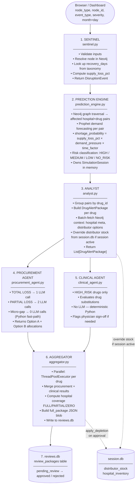

# LY Project — System Reference

> **This document is the canonical reference for the LY Project.**
> Any new LLM, agent, or developer should read this first.

---

## Project Intent

LY Project is a **pharmaceutical supply chain disruption simulation and
decision-support system**. It models a network of hospitals, drug factories,
API ingredient suppliers, and distributors. When a supply chain disruption
occurs (factory disaster, distributor failure, raw material shortage), the
system:

1. Detects which hospitals and drugs are at risk
2. Scores the risk using demand forecasts and supply loss calculations
3. Generates LLM-powered procurement bridge order recommendations
4. Generates LLM-powered clinical substitution recommendations
5. Presents structured options for a human reviewer to approve or reject
6. Tracks the decision and (eventually) depletes stock in the simulation

The system is **not autonomous** — it never auto-executes orders.
Every recommendation goes through human review and approval.

### Build Status

| Component | File | Status |
|-----------|------|--------|
| Event validation & taxonomy | `sentinel.py` | ✅ Complete |
| Demand forecasting & risk scoring | `prediction_engine.py` | ✅ Complete |
| DrugAlertPackage assembly | `analyst.py` | ✅ Complete |
| LLM procurement recommendations | `procurement_agent.py` | ✅ Complete |
| Clinical substitution logic | `clinical_agent.py` | ✅ Complete |
| Parallel orchestration & SQLite write | `aggregator.py` | ✅ Complete |
| Simulation session & depletion DB | `session_manager.py` | ✅ Complete |
| FastAPI backend (all endpoints) | `dashboard_api.py` | ✅ Complete |
| Analyst hook → session stock override | `analyst.py` | ✅ Complete |
| **Dashboard HTML/JS frontend** | `dashboard.html` | ❌ Not built yet |
| Interactive node graph (vis.js / D3) | inside `dashboard.html` | ❌ Not built yet |
| Disruption trigger panel (UI) | inside `dashboard.html` | ❌ Not built yet |
| Review cards + approval UI | inside `dashboard.html` | ❌ Not built yet |
| Depletion view panel | inside `dashboard.html` | ❌ Not built yet |

> [!IMPORTANT]
> `dashboard.html` is the **only missing piece**. The entire Python backend, pipeline,
> session management, and FastAPI API layer are fully implemented.
> A new developer/LLM should focus exclusively on building `dashboard.html`.

> [!WARNING]
> `POST /api/session/run-disruption` is **synchronous and blocks for 3–10 minutes**
> (LLM calls + 10s stagger between drugs). The frontend MUST show a loading/spinner
> state and must NOT time out the HTTP request. Consider using a polling pattern
> (fire request → poll `/api/session/state` every 5s) or WebSockets if latency
> becomes unacceptable.

- Watch stock levels deplete in real-time after each approval
- Run the next disruption against the updated (depleted) stock state
- End the session and reset to baseline

---

## Data Sources

### Neo4j Graph Database (primary structural data)
```
URI: neo4j://127.0.0.1:7687
User: neo4j
Password: QWEasd123
```

**Node types and key properties:**
| Node | Key Properties |
|------|---------------|
| `Factory` | id, name, city, monthlyCapacity |
| `Drug` | id, name, criticality, category, vulnerabilityScore |
| `API` | id, name (active pharmaceutical ingredient) |
| `Distributor` | id, name, city, reliabilityScore, pricingTier, vulnerabilityScore |
| `Hospital` | id, name, city, specialtyType, avgDailyPatients |

**Relationship types and key properties:**
| Relationship | Key Properties |
|-------------|---------------|
| `(Factory)-[:PRODUCES_API]->(API)` | capacityShare |
| `(API)-[:COMPONENT_OF]->(Drug)` | yieldMultiplier |
| `(Factory)-[:PRODUCES]->(Drug)` | *(implied via API chain — main production path)* |
| `(Distributor)-[:DELIVERS_TO]->(Hospital)` | drugId, currentStock, minOrder, deliveryDays, pricePerUnit |
| `(Hospital)-[:USES]->(Drug)` | (exists for graph traversal) |

**Main supply chain path:** `Factory → Drug → Distributor → Hospital`  
**API nodes** sit alongside this chain — each API connects to the Factory that produces it
and to the Drug it is a component of. Disrupting an API node therefore affects
both the Factory and the Drugs that depend on that ingredient.

*Note: A future upstream layer (`Supplier → API → Factory`) may be added to model
raw ingredient sourcing, but this is not in scope for the current build.*

**Critical:** `DELIVERS_TO.currentStock` is the live distributor stock value read
by the pipeline. During a simulation session this is overridden by `session.db` —
Neo4j itself is never written to.

### CSV Datasets (flat reference data)
Location: `./datasets/`

| File | Content |
|------|---------|
| `hospital_inventory.csv` | Hospital×Drug: daily_demand, current_units, days_of_stock |
| `distributor_drug_stock.csv` | Distributor×Drug flat stock (used for session seeding) |
| `distributor_catalogue.csv` | Full distributor×hospital×drug relationship data |
| `drugs.csv` | Drug metadata (id, name, criticality, category) |
| `hospitals.csv` | Hospital metadata |
| `factories.csv` | Factory metadata |
| `distributors.csv` | Distributor metadata |
| `demand_history.csv` | Historical daily demand per hospital per drug (Prophet training data) |
| `disruption_taxonomy.csv` | (node_type, event_type, severity) → (min_days, max_days) recovery |
| `api_drug_map.csv` | API → Drug mappings |
| `factory_api_map.csv` | Factory → API mappings |
| `alt_drug_map.csv` | Drug → clinical alternatives |
| `city_distance.csv` | Distributor city → Hospital delivery time |

### Prophet Models (demand forecasting)
Location: `./prophet_models/`  
Format: `{hospital_id}_{drug_id}.pkl` — one file per (hospital, drug) pair  
Trained on: `demand_history.csv` through 2024-12-31  
**Note:** Prophet captures seasonal patterns (month/day) — the year passed
to the pipeline is used only to locate the forecast window, not to change
the seasonal pattern.

---

## Architecture — 7 Pipeline Stages



---

## Module Reference

---

### `sentinel.py` — Event Intake & Validation
First stage of the pipeline. Validates a disruption event, confirms the
node exists in Neo4j, looks up recovery time from the taxonomy, and returns
a `DisruptionEvent` object that all downstream stages consume.

| Component | Type | Purpose |
|-----------|------|---------|
| `DisruptionEvent` | dataclass | Carries all event metadata (node_id, event_type, severity, recovery_days, supply_loss_pct) through the pipeline |
| `SentinelError` | exception | Hard validation failure — raised when node doesn't exist, severity is invalid, etc. Pipeline stops |
| `process_disruption()` | **public entry point** | Validates inputs, resolves node in Neo4j, looks up taxonomy, returns `DisruptionEvent` |
| `_validate_node_type()` | private | Checks node_type is Factory/Distributor/API |
| `_validate_severity()` | private | Checks severity is High/Medium/Low |
| `_validate_date()` | private | Validates date format, defaults to today |
| `_resolve_node()` | private | Confirms node exists in Neo4j, returns its name |
| `_check_taxonomy()` | private | Warns if (node_type, event_type, severity) not in taxonomy CSV |
| `_check_compound_disruption()` | private | Warns if this node is already marked offline (compound scenario) |

---

### `prediction_engine.py` — Risk Scoring & Session State
Core forecasting engine. Traverses the Neo4j supply graph to find affected
(hospital, drug) pairs, runs Prophet demand forecasts, computes
`shortage_probability = supply_loss_pct × demand_pressure × time_factor`,
and classifies risk into 4 tiers. Also owns the in-memory simulation session.

| Component | Type | Purpose |
|-----------|------|---------|
| `SimulationSession` | class | Singleton (`SESSION`) holding mutable hospital inventory. Has `reset()`, `deplete_inventory()`, `restock_inventory()`, `set_factory_offline/online()` |
| `run_prediction_pipeline()` | **public entry point** | Orchestrates graph traversal → Prophet forecasts → scoring → returns sorted risk list |
| `get_affected_pairs()` | public | Neo4j traversal for Factory/API/Distributor disruption; returns all (hospital, drug) pairs with supply metadata |
| `compute_drug_level_metrics()` | public | Per-drug: total system forecast, drug_units_remaining, demand_pressure (capped ratio) |
| `calculate_shortage_probability()` | public | Scores one (hospital, drug) pair using precomputed drug-level metrics |
| `get_prophet_forecast()` | public | Loads pkl model, forecasts 30-day demand for one (hospital, drug) from a given date |
| `load_base_data()` | public | Reads CSVs into memory (drugs, hospitals, hospital_inventory, demand). Called once at startup |
| `classify_risk()` | public | Converts probability score → HIGH/MEDIUM/LOW/NO_RISK |
| `load_taxonomy()` | public | Loads disruption_taxonomy.csv into dict at module startup |
| `BASE_DATA` | module-level dict | Loaded-once flat reference data (drug, hospital, inventory, demand) |
| `SESSION` | module-level singleton | Live `SimulationSession` instance shared across the pipeline |

---

### `analyst.py` — Package Assembly
Groups prediction engine output by drug, fetches Neo4j context for each
drug (hospital metadata, distributor options, clinical alternatives), and
builds `DrugAlertPackage` objects ready for LLM agents.

| Component | Type | Purpose |
|-----------|------|---------|
| `HospitalRisk` | dataclass | One hospital's risk data + its list of available distributors for the affected drug |
| `DrugAlertPackage` | dataclass | Full context for one drug: drug metadata, all affected hospitals, disruption context, risk flags, API context, clinical alternatives. Passed to both agents |
| `analyse()` | **public entry point** | Groups prediction results by drug, builds all packages, returns `List[DrugAlertPackage]` sorted HIGH first |
| `_build_drug_alert_package()` | private | Builds one DrugAlertPackage — all Neo4j context batched here |
| `_fetch_distributor_options()` | private | Single batch Neo4j query for distributor stock/delivery/price for all hospitals for one drug. **Calls `session_manager.override_analyst_stock()`** when session is active |
| `_fetch_hospital_context()` | private | Batch Neo4j query for hospital metadata |
| `_fetch_drug_context()` | private | Neo4j query for API vulnerability + clinical alternatives |
| `_determine_overall_risk()` | private | Returns highest risk tier across all hospitals for a drug |

---

### `procurement_agent.py` — LLM Bridge Order Generation
Takes a `DrugAlertPackage`, builds a structured LLM prompt, calls Gemini,
parses the response, and returns a procurement result with Option A
(Universal Coverage) and Option B (Ruthless Triage) allocations.

| Component | Type | Purpose |
|-----------|------|---------|
| `run_procurement_agent()` | **public entry point** | Decides TOTAL LOSS vs PARTIAL LOSS path, calls LLM, returns procurement result dict |
| `_call_gemini()` | private | Makes one LLM API call. Creates a fresh `genai.Client` per call for thread isolation |
| `_build_bridge_prompt()` | private | Assembles full LLM prompt for the bridge order (partial loss path) |
| `_build_task()` | private | The task/instruction section of the bridge prompt |
| `_disruption_block()` | private | Disruption context block for the prompt |
| `_drug_block()` | private | Drug metadata block for the prompt |
| `_hospitals_with_distributors_block()` | private | Per-hospital section with nested distributor options |
| `_execute_order()` | private | Converts LLM hospital→distributor assignment JSON into a fully computed order list with exact-change math |
| `_parse_json()` | private | Robust JSON extraction from LLM response (handles markdown fences, partial JSON) |
| `_strip_scratchpads()` | private | Removes scratchpad keys from JSON before final parse (brace-matched extraction) |
| `print_procurement_result()` | public | Pretty-prints Option A/B allocation tables to terminal |
| `MICRO_GAP_FAST_PATH` | config bool | `True` = skip LLM when total bridge < min MOQ. `False` = always call LLM |

---

### `clinical_agent.py` — Substitution Recommendation
For HIGH_RISK drugs only. Evaluates whether a clinical alternative drug
exists, how similar it is, and whether a physician must sign off.
Does NOT call the LLM — all logic is deterministic Python from Neo4j data.

| Component | Type | Purpose |
|-----------|------|---------|
| `ClinicalAssessment` | dataclass | Structured output: substitution_viable, recommended_alt, similarity_score, tier, physician_approval, caveats |
| `run_clinical_agent()` | **public entry point** | Evaluates alternatives from `DrugAlertPackage.alternatives`, returns `ClinicalAssessment` |
| `_classify_alternatives()` | private | Splits alternatives into viable/blocked based on similarity score and shared API risk |
| `_requires_physician()` | private | Flags physician approval if tier is last_resort or alt is also at risk |
| `_build_hospital_list()` | private | Sorts hospitals by urgency, identifies critically urgent ones |
| `_build_caveats()` | private | Assembles system-wide caveats (no LLM — purely data-driven) |
| `_similarity_tier()` | private | Maps similarity score → first_line / second_line / last_resort |

---

### `aggregator.py` — Orchestration & Storage
Parallel execution coordinator. Submits all actionable drugs to a
`ThreadPoolExecutor`, collects results, builds review packages, writes
to SQLite, and returns pending packages for human review.

| Component | Type | Purpose |
|-----------|------|---------|
| `aggregate()` | **public entry point** | Runs procurement + clinical agents in parallel, aggregates results, writes to SQLite |
| `init_db()` | public | Creates `review_packages` table if it doesn't exist |
| `get_pending_packages()` | public | Returns all `pending_review` packages from SQLite as dicts, sorted by risk |
| `update_package_status()` | public | Marks a package approved/rejected in SQLite |
| `get_package_by_id()` | public | Fetches one package by its package_id |
| `_build_review_package()` | private | Assembles the full `full_package` JSON blob from all agent outputs |
| `_compute_hospital_coverage()` | private | Derives FULL/PARTIAL/ZERO coverage status per hospital from option_a allocations |
| `_build_action_summary()` | private | One-line text summary for dashboard card (e.g. "2 hospital(s) partially covered") |
| `_write_to_sqlite()` | private | Inserts or replaces one package in SQLite |
| `_is_fully_covered()` | private | True if all actionable hospitals are FULL |

---

### `session_manager.py` — Simulation Session & Depletion DB
Persists live simulation state to `session.db` so the Flask dashboard
can read/write stock levels across HTTP requests. The single source of
truth for distributor stock and hospital inventory during a session.

| Component | Type | Purpose |
|-----------|------|---------|
| `start_session()` | **public** | Seeds `session.db` — dumps Neo4j `DELIVERS_TO.currentStock` + `SESSION.inventory` into SQLite tables |
| `end_session()` | **public** | Marks session inactive in DB, calls `SESSION.reset()` |
| `apply_depletion()` | **public** | On order approval: deducts from `distributor_stock`, restocks `hospital_inventory`, syncs `SESSION` |
| `override_analyst_stock()` | **public** | Called by `analyst._fetch_distributor_options()` — patches Neo4j stock values with live session values |
| `get_session_state()` | **public** | Returns full depletion delta snapshot (baseline vs current) for dashboard display |
| `is_active()` | **public** | Returns True if session.db exists with active session row |
| `get_distributor_stock()` | **public** | Single stock lookup by (distributor_id, hospital_id, drug_id) |
| `get_all_distributor_stock()` | **public** | Full stock dict for batch override |
| `_neo4j_all_stock()` | private | Pulls all `DELIVERS_TO` stock data from Neo4j for seeding |
| `session.db` tables | SQLite | `session_info`, `distributor_stock`, `hospital_inventory` |

---

### `gnn_centrality.py` — Drug Network Vulnerability Scoring
One-time setup script. Uses GDS (Graph Data Science) in Neo4j to compute
betweenness centrality and dependency scores for every node, then writes
`vulnerabilityScore` back to Drug, Factory, Distributor, and API nodes.

| Component | Type | Purpose |
|-----------|------|---------|
| `project_graph()` | public | Projects the supply graph into GDS memory |
| `run_betweenness()` | public | Runs betweenness centrality, normalises per label, writes `centralityScore` |
| `compute_dependency_scores()` | public | Scores each node's supply dependency weight |
| `compute_vulnerability_score()` | public | Combines centrality + dependency → `vulnerabilityScore` on each node |
| `print_report()` | public | Prints top vulnerable nodes per type |
| `spot_checks()` | public | Validates specific known-high-risk nodes have expected high scores |

---

### `dashboard_api.py` — FastAPI Backend
Serves the dashboard HTML and exposes JSON endpoints. The single backend
process that bridges the browser to all Python pipeline code.

| Component | Type | Purpose |
|-----------|------|---------|
| `index()` | route GET `/` | Serves `dashboard.html` |
| `db_list()` | route GET `/api/db-list` | Lists all `.db` files in project dir (newest first) |
| `stats()` | route GET `/api/stats` | Aggregate counts: total, high_risk, pending, dicey, zero_hospitals, event metadata |
| `packages()` | route GET `/api/packages` | All package summaries from a DB, sorted HIGH→LOW |
| `package_detail()` | route GET `/api/packages/<id>` | Full package JSON for one drug |
| `heatmap()` | route GET `/api/heatmap` | Hospital × Drug coverage matrix (FULL/PARTIAL/ZERO/NONE per cell) |
| `distributors()` | route GET `/api/distributors` | Distributor stress: total units assigned, below-min count, drugs/hospitals served |
| `package_action()` | route POST `/api/packages/<id>/action` | Approve Option A/B or Reject — updates SQLite status |
| `resolve_db()` | helper | Returns path to named DB or latest DB if none specified |

---

### `test_runner.py` — Interactive Test Harness
CLI menu for running any of the 6 canned disruption scenarios end-to-end.
Each case has a pre-defined node, event type, severity, date, and dedicated
output DB. Calls `SESSION.reset()` after each run.

| Component | Type | Purpose |
|-----------|------|---------|
| `CASES` | list of dicts | 6 scenario definitions: num, title, description, node_type, node_id, event_type, severity, date, db |
| `run_pipeline()` | **main function** | Full pipeline: Sentinel → Prediction Engine → Analyst → parallel Agents → Aggregator. Prints summary |
| `print_menu()` | public | Displays the interactive case selection menu |
| `pick_case()` | public | Reads user input, returns selected case dict |

---

## SimulationSession (prediction_engine.py)

The `SESSION` singleton manages mutable in-memory state:

```python
SESSION.inventory           # dict: (hosp_id, drug_id) → {current_units, daily_demand}
SESSION.factory_status      # dict: factory_id → "offline"/"online"
SESSION.reset()             # restore inventory to BASE_DATA baseline
SESSION.deplete_inventory() # deduct units from a hospital
SESSION.restock_inventory() # add units to a hospital
```

`SESSION.reset()` is called at the end of each test case in `test_runner.py`
to restore baseline state between runs.

---

## LLM Integration

**Model:** `gemma-4-26b-a4b-it` (Google AI Studio, free tier, 15 RPM)  
**Library:** `google-genai` Python SDK  
**Config toggle:** `MICRO_GAP_FAST_PATH = True/False` in `procurement_agent.py`

### TOTAL LOSS path (supply_loss_pct = 1.0)
- 1 LLM call
- All hospitals compete for the same distributor pool
- LLM assigns distributors, does exact-change math across all hospitals

### PARTIAL LOSS path (supply_loss_pct < 1.0)
- Python computes which hospitals have a bridge gap (stockout before recovery)
- Call 1: Bridge order — LLM generates Option A (Universal Coverage) + Option B (Ruthless Triage)
- Call 2: Scratchpad extraction — LLM parses its own scratchpad into unit caps

### Micro-gap fast-path (MICRO_GAP_FAST_PATH = True)
- Condition: `total_bridge < min(all distributor MOQs)`
- Python resolves deterministically (no LLM) — picks highest-stock in-time distributor
- Eliminates 2-7 min LLM hangs for trivial cases where every option is BELOW MIN anyway

### Parallelism
- All actionable drugs run simultaneously via `ThreadPoolExecutor`
- 10-second stagger between LLM submissions to stay under 15 RPM
- Each thread gets a fresh `genai.Client` instance (no shared connection pool)
- Per-drug `try/except` — one failure prints `[✗]` and pipeline continues

---

## SQLite Review Package Schema

**Table:** `review_packages`  
**Columns (flat):**
```
package_id, disruption_node, disruption_event, disruption_severity,
drug_id, drug_name, criticality, overall_risk_level,
procurement_viable, clinical_suppressed, substitution_viable,
status, created_at, resolved_at, procurement_action, clinical_action, full_package
```

**`full_package` JSON structure:**
```
{
  disruption:        { node_id, node_name, type, event_type, severity, recovery_days, date }
  drug:              { drug_id, name, criticality, supply_loss_pct, demand_pressure,
                       drug_units_remaining, system_total_forecast, vulnerability_score }
  hospital_coverage: [ { hospital_id, hospital_name, city, specialty_type,
                          shortage_probability, days_until_stockout,
                          units_required, units_acquired, coverage_gap,
                          coverage_pct, coverage_status } ]
  procurement:       { scenario, viable, is_dicey_case, dicey_tradeoff,
                        recommendation_summary, total_stock_gap, caveats,
                        option_a: [ { distributor_id, distributor_name,
                                      total_quantity, price_per_unit,
                                      hospital_allocations: [ { hospital_id,
                                        delivery_days, gap_days,
                                        units_required, units_allocated,
                                        coverage_note } ],
                                      distributor_caveat } ],
                        option_b: [ same structure ] }
  clinical:          { suppressed, substitution_viable, recommended_alt_id/name,
                        similarity_score, requires_physician_approval,
                        viable_alternatives, blocked_alternatives }
}
```

---

## Dashboard

**Tech stack:** FastAPI (`dashboard_api.py`) + single-page HTML/JS frontend  
**Backend:** Reads `reviews.db` (pipeline output) + `session.db` (simulation state)  
**Run:** `uvicorn dashboard_api:app --reload --port 8000`  
**Auto-docs:** `http://localhost:8000/docs` (FastAPI Swagger UI)

### Dashboard Flow:
1. **Start Session** → calls `session_manager.start_session()`
2. **Node Graph** → supply chain network visualised as: `Factory → Drug → Distributor → Hospital`
   - API nodes are shown connected to their Factory and Drug but are not part of the main chain
   - Clickable nodes: Factory, Distributor, API (these can be disrupted)
   - Display-only nodes: Drug, Hospital (no disruption action)
3. **Disruption Panel** → selects: event_type, severity, month+day (year auto-set to current)
   - Fires full pipeline: Sentinel → Analyst → Agents → Aggregator
4. **Review Panel** → shows drug risk cards, hospital coverage, Option A vs Option B
   - User approves → `apply_depletion()` called → stock depleted in session.db
5. **Depletion View** → shows updated stock levels (baseline vs current) per distributor
6. **End Session** → `session_manager.end_session()` → all stock resets to baseline

### FastAPI Endpoints:
| Endpoint | Method | Purpose |
|----------|--------|---------|
| `/api/db-list` | GET | List available review DBs |
| `/api/packages` | GET | All packages summary from a DB |
| `/api/packages/<id>` | GET | Full package detail |
| `/api/stats` | GET | Aggregate counts for event banner |
| `/api/heatmap` | GET | Hospital × Drug coverage matrix |
| `/api/distributors` | GET | Distributor stress (assigned vs stock) |
| `/api/packages/<id>/action` | POST | Approve Option A/B or Reject |
| `/api/session/start` | POST | Start simulation session — seeds session.db from Neo4j + SESSION |
| `/api/session/end` | POST | End session — marks inactive, resets SESSION |
| `/api/session/state` | GET | Current depletion delta snapshot (baseline vs current per distributor) |
| `/api/session/run-disruption` | POST | **Triggers full pipeline** — accepts node_type, node_id, event_type, severity, month, day. Writes to reviews.db |
| `/api/graph/nodes` | GET | **Returns all nodes + edges for vis.js graph** — Factory, Drug, Distributor, Hospital, API nodes with their connections |

---

## Input Parameters

```python
process_disruption(
    node_type      = "Factory" | "Distributor" | "API",
    node_id        = "F001" | "F002" | "F004" |       # Factories
                     "S001"..."S010" |                  # Distributors
                     "A004" | "A012",                   # API ingredients
    event_type     = "Disaster" | "Strike" |
                     "Logistics Failure" |
                     "Supply Chain Failure" |
                     "Raw Material Shortage",
    severity       = "High" | "Medium" | "Low",
    triggered_date = "YYYY-MM-DD"  # Year is synthetic — only month+day matters for Prophet
)
```

---

## Test Scenarios (test_runner.py)

| # | Node | Event | Sev | DB | Key drugs |
|---|------|-------|-----|-----|----------|
| 1 | F002 Cipla | Strike | High | test_F002_Strike_High.db | Ventorlin, Asthalin, Brufen |
| 2 | F001 | Disaster | High | test_F001_Disaster_High.db | Different portfolio |
| 3 | A012 | Supply Chain Failure | High | test_A012_SCF_High.db | All A012-dependent drugs |
| 4 | A004 | Raw Material Shortage | High | test_A004_RMS_High.db | All A004-dependent drugs |
| 5 | F004 | Disaster | High | test_F004_Disaster_High.db | Storvas, Amaryl, Atorva, Glycomet |
| 6 | S003 | Logistics Failure | Medium | test_S003_LogFail_Medium.db | Brufen, Levoflox, Storvas |

---

## Known Gotchas

- **Tenacity silent retries:** The `google-genai` SDK retries 429 errors with exponential backoff (up to 60s per sleep). A "hung" drug thread is almost always a tenacity retry, not a crash. Errors only surface after all 5 retry attempts fail.
- **Distributor stock in Neo4j, NOT CSV:** The `distributor_drug_stock.csv` is reference data used for session seeding. The live structural stock values used by `analyst.py` come from `DELIVERS_TO.currentStock` in Neo4j.
- **Hospital inventory in SESSION, NOT DB:** `prediction_engine.SESSION.inventory` is the runtime source. It's loaded from `hospital_inventory.csv` at startup and mutated in-memory. `session_manager` persists this to `session.db`.
- **Year in dates:** Pass any year — Prophet seasonal patterns are month/day based. The year only affects how many extra periods Prophet forecasts past its training cutoff (2024-12-31).
- **Micro-gap fast-path:** `MICRO_GAP_FAST_PATH = True/False` at top of `procurement_agent.py`. Set False to force LLM calls for benchmarking.
- **`reviews.db` is a permanent audit log — it is never reset or deleted.** It is initialized automatically when the FastAPI server starts (`aggregator.init_db()` called in lifespan). All disruption runs across all sessions accumulate here permanently. This is intentional — it is the historical record of every decision made in the system. Do not delete it between sessions.
- **`session.db` and `reviews.db` do not exist until runtime.** `session.db` is created the moment `POST /api/session/start` is called. `reviews.db` is created by the aggregator the first time a disruption runs. Neither is shipped with the code — their absence from the project directory is normal.
- **Node ID format:** When the user clicks a node in the graph and triggers a disruption, the frontend must send the correct `node_id` to `/api/session/run-disruption`. Format: Factories = `F001`–`F005`, Distributors = `S001`–`S010`, APIs = `A004`, `A012`, etc. These IDs come directly from Neo4j node `.id` properties and are included in the `/api/graph/nodes` response.
- **Graph scale — use hierarchical layout, NOT force-directed.** Neo4j contains **1,877 total edges** (1,640 DELIVERS_TO + 200 USES + 17 PRODUCES_API + 20 COMPONENT_OF). Rendering all of these would be unusable. The `/api/graph/nodes` endpoint returns only **~137 structural edges** for visualization: 17 Factory→API + 20 API→Drug + 100 Distributor→Hospital (deduplicated from 1,640 — one edge per distributor–hospital pair regardless of drug). USES edges (Hospital→Drug, 200 edges) are intentionally hidden to keep rendering fast. Use vis.js Network with `layout: { hierarchical: { direction: 'LR', sortMethod: 'directed', levelSeparation: 200, nodeSpacing: 80 } }` and `physics: { enabled: false }`. This renders the chain as clean left-to-right levels.
- **LLM rate limit — do not reduce the 10s stagger.** The pipeline staggers LLM calls by 10 seconds between drugs specifically to stay under the Gemini free tier limit of 15 requests per minute. Reducing this will cause 429 errors that trigger tenacity retries, making the pipeline appear hung.
- **`test_runner.py` writes to named DBs, not `reviews.db`.** Running test cases will NOT pollute the dashboard's review queue. Each test case writes to its own `test_*.db` file.
